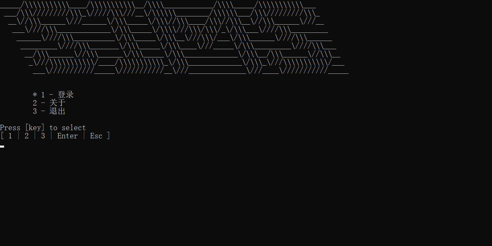
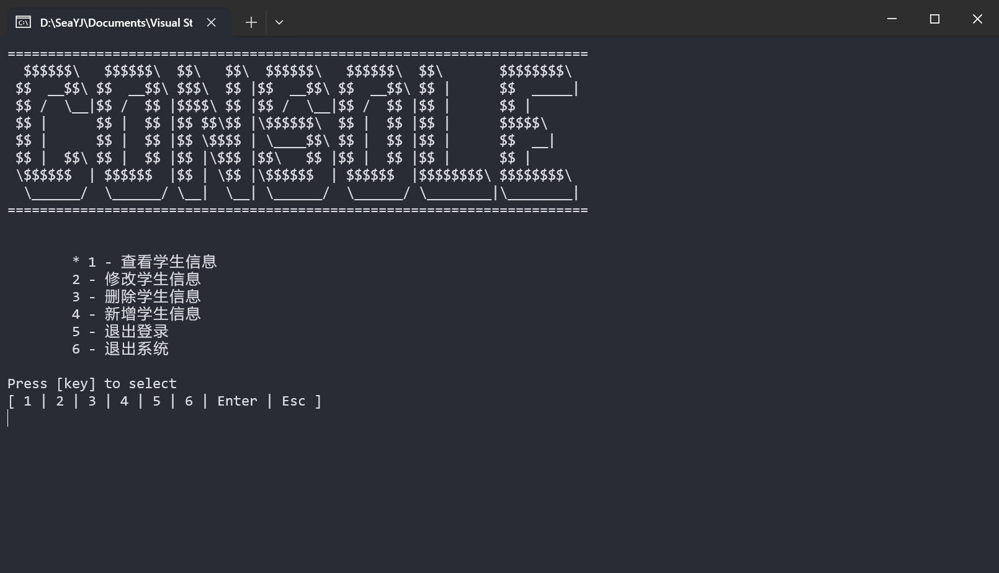

# 👔 学生信息管理系统（SIMS）

一个用 C++ 编写的令人印象深刻的学生信息管理系统。

每个学生都可以编写自己的学生管理系统（SIMS），但不是每个学生都能编写出像这样的系统。

## 程序运行截图




# 🏏 项目编译

## 编译环境要求

|Component|Requirement|
|:--|:--|
| C++ | >= ISO C++17 标准|
| C | >= ISO C11 标准 |
| OS | Windows / Linux<br/>(理论上支持 Linux) |

## 编译项目

1. 克隆项目，你可以使用以下命令：
```console
git clone git@github.com:SeaYJ/StudentInformationManagementSystem.git
```
或者
```console
git clone https://github.com/SeaYJ/StudentInformationManagementSystem.git
```

> 下面以 Windows 10 的 Vsiual Studio 2022 为例子进行描述，仅作参考。

2. 打开 `/StudentInformationManagementSystem/SIMS/deps/sqlite3/lib` 文件夹，将 `sqlite3.dll` 文件复制一份到你的运行环境目录(DEBUBG/RELEASE)中。
3. 打开 VS 2022，直接编译该项目（缺失 `sqlite3.dll` 文件就是第 2 步没做对）。

# 📚 项目核心技术知识点

1. 面向对象程序设计。
	- 继承
	- 多态：函数重载、模板、虚函数（现在未使用，未来会添加）、抽象类（现在未使用，未来会添加）、接口类（现在未使用，未来会添加）等。
	- 封装
2. 操作符重载。
3. C++ STL 容器及算法。
4. 类的“深拷贝”与“浅拷贝”。
5. C++ 17 的一些新语法尝试。
6. 函数映射/函数表（Function Table）。
7. SFINAE 机制（解决函数重载解析问题）。
8. Traits 技术（目前使用 C++17 新特性 `std::variant` 实现，未来会增加该实现）。
9. 程序内嵌 SQLite3 数据库（同时解决 Windows 平台 GBK 编码与 SQLite3 数据的 UTF-8 编码问题）。下面是一些我写的相关内容：
	- [配置 SQLite3 数据库](https://www.seayj.cn/articles/94e9/)
	- [解决编码问题](https://www.seayj.cn/articles/94e9/#si-jie-jue-sq-lite-3-zhong-wen-luan-ma-wen-ti)
	- [Stack Overflow 提问]()
10. size_t 与 int 相遇时的坑（尤其注意 STL 的 size() 函数）。下面是我写的相关内容文章：
	- [奇怪的循环分析 II](https://www.seayj.cn/articles/ccac/)
11. 使用 CryptoPP 库进行数据加密与解密（仅限会用）：
	- ASE(用于登录账号信息加密)
	- PBKDF2(用于数据库文件名加密)
12. 向前声明原则（暂未整理实现）：通常用于避免头文件的循环依赖或减少编译时间。

> 一些更零散的小知识，这里不一一列举了，上面只是我认为我写这个项目时使用的**相对来说比较重要**的技术知识。

# 🏷 项目待改进问题

> 因为后面写的比较急，在所以第一代留下了一些小问题，后续会修改问题并实现一些还未实现的技术。

- [ ] 修改、删除、新增学生信息时，应该在修改数据库内容后重新读取被修改的内容，而不是直接在程序的 STUDENTS 变量中对应修改。
- [ ] 实现计划中的“虚函数”技术。
- [ ] 实现计划中的“抽象类”技术。
- [ ] University、Person、Student 等类中对一些关键属性的安全检查静态函数缺失，并且应该在程序逻辑中使用（已实现对身份证号码的检测，但是并未在程序逻辑中使用）。
- [ ] 控制台彩色字体输出（需要进一步完善 ConsoleColor 类）。
- [ ] 在 main 中的函数设计有一点点乱，需要统一再设计，做好封装。
- [ ] 头文件加载问题：应该遵循“单文件最大完整性原则”和“向前声明原则”。
- [ ] 对于一些代码逻辑要做好安全检查（后面写的急，少部分位置未做安全检查）。
- [ ] 界面跳转逻辑仍不够完美，特别是对异常和错误信息的输出机制，还需要重新设计完善。
	- [ ] 查看、修改、删除、新增学生信息等界面的内嵌页面内容处理的不完美。
	- [ ] 对于异常错误信息处理不完善，经常被新界面覆盖导致无法看到。当前设计：弄一个接口，然后再在 xxxUI 函数中实现函数回调，用来处理差异输出和信息提示。 
- [ ] 应该对 Linux 系统做实机测试。
- [ ] 代码超详细注释：关键注释、函数说明注释(以 VS 格式)、细节注释等。
- [ ] 数据库应该做详细的数据约束和一些必要的触发器。

# 📃 开源协议

本项目遵守 [MIT License](./LICENSE)，请务必遵守。